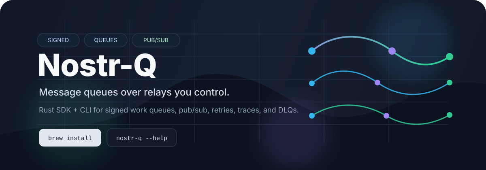
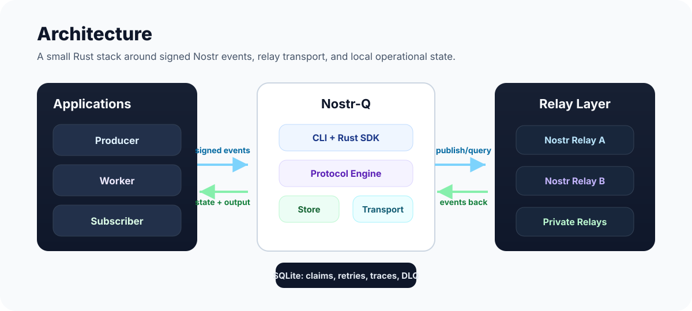
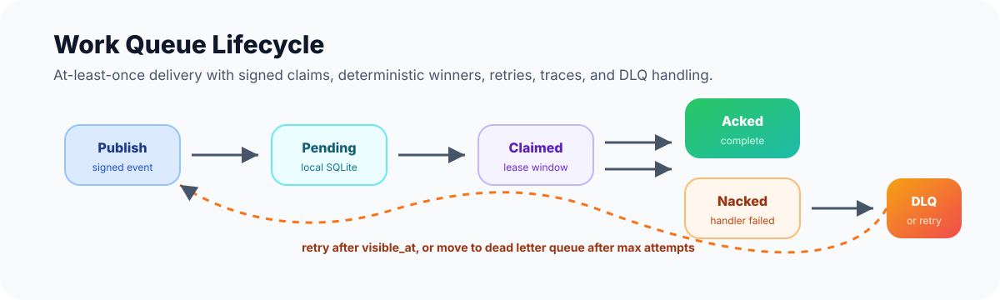

<p align="center">
  
</p>

<p align="center">
  <a href="https://github.com/EricGrill/nostr-q/actions/workflows/ci.yml"></a>
  <a href="LICENSE"></a>
  
  
</p>

<h3 align="center">Signed message queues, work queues, and pub/sub over Nostr relays.</h3>

<p align="center">
  Nostr-Q is a Rust SDK and CLI that lets producers, workers, and subscribers
  coordinate through signed Nostr events while keeping local SQLite state for
  claims, retries, traces, and dead letters.
</p>

<p align="center">
  <a href="#install"><strong>Install</strong></a>
  ·
  <a href="#quick-start"><strong>Quick Start</strong></a>
  ·
  <a href="docs/PROTOCOL.md"><strong>Protocol</strong></a>
  ·
  <a href="CONTRIBUTING.md"><strong>Contribute</strong></a>
</p>

---

## Why Nostr-Q

Most queue systems start with a broker. Nostr-Q starts with signed events and
relays you can run yourself.

| Capability | What it gives you |
| --- | --- |
| **Signed queue traffic** | Every publish, claim, ack, nack, heartbeat, and DLQ event is a signed Nostr event. |
| **No central queue broker** | Coordinate through one or more Nostr relays instead of adding another service dependency. |
| **Local operational state** | Each participant tracks relay config, queue state, retries, traces, and DLQ records in SQLite. |
| **CLI-first workflow** | Initialize keys, add relays, create queues, publish messages, run workers, inspect, trace, and retry from one binary. |
| **Embeddable Rust SDK** | The CLI is a thin layer over the same `nostr_q` primitives available to Rust applications. |

## Architecture

<p align="center">
  
</p>

Nostr-Q has a small, layered workspace:

```text
crates/
  nostr-q-core/    Protocol types, event kinds, tags, IDs, and envelopes
  nostr-q-store/   SQLite state store
  nostr-q-relay/   Transport trait, mock transport, and nostr-sdk transport
  nostr-q/         SDK facade
  nostr-q-worker/  Worker runtime
  nostr-q-cli/     CLI package, installed as `nostr-q`
```

Read the wire protocol in [docs/PROTOCOL.md](docs/PROTOCOL.md).

## Install

The public command is `nostr-q`.

| Platform | Command | Status |
| --- | --- | --- |
| macOS | `brew install EricGrill/tap/nostr-q` | Available after first GitHub release and tap setup |
| Linux | `curl --proto '=https' --tlsv1.2 -LsSf https://github.com/EricGrill/nostr-q/releases/latest/download/nostr-q-cli-installer.sh \| sh` | Available after first GitHub release |
| Windows | `powershell -ExecutionPolicy Bypass -c "irm https://github.com/EricGrill/nostr-q/releases/latest/download/nostr-q-cli-installer.ps1 \| iex"` | Available after first GitHub release |
| Rust source | `cargo install --path crates/nostr-q-cli --locked` | Works from a local checkout |

`brew install nq` is intentionally not used. Homebrew Core already owns `nq`
for an unrelated command-line queue utility, so this project publishes the
unambiguous `nostr-q` binary.

See [docs/INSTALL.md](docs/INSTALL.md) for Cargo, Homebrew, shell installer,
PowerShell, Winget, and Scoop notes.

## Quick Start

Run a disposable local relay in Docker:

```sh
mkdir -p .local/nostr-rs-relay
docker run --rm -it \
  --name nostr-q-relay \
  -p 7000:8080 \
  --mount "src=$(pwd)/.local/nostr-rs-relay,target=/usr/src/app/db,type=bind" \
  scsibug/nostr-rs-relay:latest
```

In another terminal, create isolated local config and queues:

```sh
export NOSTR_Q_CONFIG=/tmp/nostrq/config.toml
export NOSTR_Q_STATE=/tmp/nostrq/state.db

nostr-q init
nostr-q key generate
nostr-q relay add ws://localhost:7000
nostr-q relay health

nostr-q queue create jobs.email --mode work_queue --delivery at_least_once
nostr-q queue create events.user.created --mode pubsub
```

Publish and consume a pub/sub event:

```sh
nostr-q sub events.user.created
```

```sh
export NOSTR_Q_CONFIG=/tmp/nostrq/config.toml
export NOSTR_Q_STATE=/tmp/nostrq/state.db
nostr-q pub events.user.created '{"id":7}'
```

Run a work-queue handler:

```sh
nostr-q pub jobs.email '{"to":"user@example.com","template":"welcome"}'
nostr-q worker jobs.email --exec 'cat > /tmp/nostrq/handled.json'
```

Inspect what happened:

```sh
nostr-q inspect jobs.email
nostr-q trace <trace-id>
nostr-q dlq list
```

## Message Lifecycle

<p align="center">
  
</p>

Work queues are lease based:

1. A producer publishes a signed message event.
2. Workers ingest the event into local SQLite state.
3. Competing workers publish signed claim events.
4. The deterministic claim winner processes the message.
5. The worker signs an ack, nack, retry, or dead-letter event.
6. Operators can inspect depth and trace a message by trace ID or message ID.

## CLI Surface

```text
nostr-q init
nostr-q key generate|show
nostr-q relay add|list|remove|health
nostr-q queue create|list
nostr-q pub <queue-or-topic> <json>
nostr-q sub <topic>
nostr-q worker <queue> --exec <cmd>
nostr-q worker <queue> --http <url>
nostr-q inspect <queue>
nostr-q trace <trace-id-or-message-id>
nostr-q dlq list|retry
```

## Guarantees

| Area | Current behavior |
| --- | --- |
| Work queues | At-least-once delivery with lease-bounded claims. Handlers should be idempotent. |
| Pub/sub | Best-effort fanout without claim or ack tracking. |
| Relays | Public relays are fine for demos; production workloads should use private or self-hosted relays. |
| Payloads | Plaintext Nostr events today. Do not put secrets in payloads until NIP-04/NIP-44 support lands. |
| Tests | Automated tests use `MockTransport`, so a live relay is not required. |

## Configuration

Default locations:

| Setting | Default |
| --- | --- |
| Config | `~/.config/nostr-q/config.toml` |
| SQLite state | `~/.local/share/nostr-q/state.db` |
| Project override | `./nostr-q.toml` |
| Environment overrides | `NOSTR_Q_CONFIG`, `NOSTR_Q_STATE`, `NOSTR_Q_PRIVATE_KEY` |

Example config:

```toml
state = "~/.local/share/nostr-q/state.db"
key_file = "~/.config/nostr-q/key"
```

Never commit private keys, local databases, or relay state.

## Rust SDK

```rust
use std::sync::Arc;
use nostr_q::{NostrQ, relay::NostrTransport, store_crate::Store};

let store = Arc::new(Store::open("state.db".as_ref())?);
let keys = nostr::Keys::parse(&std::env::var("NOSTR_Q_PRIVATE_KEY")?)?;
let transport = Arc::new(
    NostrTransport::connect(keys.clone(), &["wss://relay.example.com".into()]).await?,
);

let queue = NostrQ::new(keys, store, transport);
queue
    .publish("jobs.email", serde_json::json!({"to": "a@b.c"}), None)
    .await?;
```

## Development

```sh
cargo fmt --all -- --check
cargo check --workspace --locked
cargo test --workspace --locked
cargo clippy --workspace --all-targets --locked -- -D warnings
```

## Release Packaging

Releases are configured with `cargo-dist`:

| Artifact | Output |
| --- | --- |
| macOS | Apple Silicon and Intel archives plus Homebrew formula |
| Linux | x64 and ARM64 archives plus shell installer |
| Windows | x64 archive plus PowerShell installer |
| GitHub | Release notes, checksums, and downloadable installers |

Release maintainers should follow [RELEASING.md](RELEASING.md).

## Roadmap

- `nostr-q dev` for a one-command local relay and config sandbox.
- NIP-04/NIP-44 payload encryption.
- Queue config get/set/show/delete commands.
- Standalone ack, nack, and retry commands.
- Prometheus or OpenTelemetry metrics.
- Additional state stores beyond SQLite.

## Contributing

Issues, bug reports, and pull requests are welcome. Start with
[CONTRIBUTING.md](CONTRIBUTING.md), and please run the development checks
before opening a PR.

Security reports should follow [SECURITY.md](SECURITY.md). General usage
questions belong in GitHub Discussions once the repository is public; see
[SUPPORT.md](SUPPORT.md).

## License

MIT. See [LICENSE](LICENSE).
